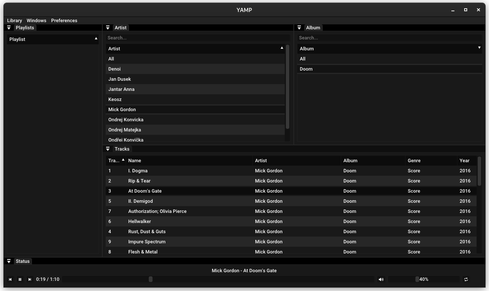

# YAMP
YAMP is a cross-platform music player written in C++.



# Features
- Supports MP3, FLAC and WAV
- Playlists
- Themes
- Unicode support
- Cross-platform, works on Linux, FreeBSD, Windows(WIP)

# Planned Features
- Support for additional audio formats (M4A, AAC, OGG)
- Integration with streaming services (Spotify)
- Plugins
- Customizable hotkeys
- Support for multiple languages
- Node based post-processing

# Building

#### Clone repository
```
git clone --recurse-submodules <repo url>
``` 

#### Linux

```
mkdir build
cd build
cmake ..
make
```

#### Windows

```
WIP
```

# License

This project is licensed under the GPLv3 License. See the LICENSE file for details.